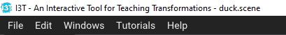

# I3T Manual

Introduction and a short program description. A good idea is to read the tutorial (In Czech: 1. Začínáme s I3T a 5. Pokročilé funkce programu).

## User interface
The program starts with a *Start window* that serves as a signpost between selecting ready-made tutorials, opening an existing scene, or starting a new one.

Once selected, it enters the workspace mode, consisting of two main windows. [i3tscreens](../Data/tutorials/1TUT/i3tscreens.png)

In the *workspace* window, the user prepares individual transformations and models and plugs
them into the scene graph. The resulting 3D representation of the structure generated
by the graph is immediately visible in the 3D view in the *Scene View* window. 

The basic building block in the workspace window is a small rectangle
with the title and contents, called *box*. 
[Matrix with a model](../Data/tutorials/1TUT/hintPosun.png)
The matrices are
boxes with a 4x4 grid of real numbers. Matrices affect the object
by being combined in the scene graph as they are put into a
larger box called a sequence.

Sequences have inputs and outputs marked by small icons.
The [*x icon*](../Data/tutorials/1TUT/mult.png) represents matrix multiplication and matrices are multiplied
by using the left-to-right order. The remaining [*icons with triangles*](../Data/tutorials/1TUT/vec3.png) represent
either input or output of the copy of the box.

The key benefit of the I3T tool is its interactivity. The user can
construct the scene graph interactively by ordering the matrices into
sequences, the sequences into graphs, and also interactively modify
the values in the matrices. The effect of the transformation is
immediately shown in the 3D scene view (Figure 1 and the accompanying
video).

 top bar (how to load, append, save...), shortcuts

### Windows list
- Start window - sign post, contains a list tutorials that teach basic controls
- Workspace - main window for working with the program and buildidng the scene graph
- Scene view - shows what you created in the workspace window

### Main bars
The I3T application has a stadard main menu in its top. 

- File 
  - Open - standard file dialog for scene file opening. The scenes should be located in Data/Scenes/ directory.
  - Recent - list of recently used scenes for fast opening
  - Save, Save As - sceen file output to disk
  - Manage Models - Place for including new models into I3T. The format should be .gltf with .bin, or .glfb
  - Exit - leaves I3T
Edit - A small menu with a single item
  - Preferences 
     - setup of the model preview in the model box in the workspace
     - setup of the selected model highliht in the Scene View 
     - setupo of  the grid in the Scene View 
Windows - window selector
Tutorials - Link to start window with the list of tutorials available 
Help 
  - About window with info about the application
  - Demo window of the DearImGui library
  - Style editor for Theme (skin) selection and skin modification 
  - Debug info

### Shortcuts
copy/paste/cut, ...

## Workspace

Deeper description of the node system - how to add nodes, connect them and work with them

### Tracking

Introduce the tracking functionality, define what is needed to run it and showcase the controls (smooth/jagged tracking)

### Camera

Introduce cameras and screens and showcase how they work in the program

### Operators

Define the use cases for operators and show a sample situation, show the 10th folta scene

## Manipulators

Introduce manipulators

## Tutorials

In I3T, tutorials are an interactive way for new users to become more familiar with the program while learning important theory about I3T features.

A total of **nine tutorials** are available. **Five** of them focus on the **basics**, while the remaining **four** focus more on **advanced features**.

Before working with the program, we recommend to **try to go through at least the basics** (5 introductory tutorials), but if you already know the basics of transformations,
matrix multiplication, projection matrices, and cameras, you may want to take the **alternative tutorial**, which skips the theoretical parts of the introductory series.

If the user already knows what they are doing, they can try **exercises** (the last two tutorials), that test the user's ability to handle complex tasks with more vague instructions.

# Technical manual

## GUI
tbd

## DIWNE
See the [DIWNE documentation](../Source/DIWNE/Docs/docs.md)

## Tutorials

Main classes for handling tutorials are ``TutorialWindow``, ``StartWindow``, ``TutorialLoader``, ``Tutorial``, an ``Theme``

Tutorials can be accessed through the Start window, which lists all tutorials located in the ``Data/tutorials`` folder.

Tutorials are loaded from ``*.tut'' files using the ``TutorialLoader'' class, which processes all data from the source files into an instance of the ``Tutorial'' class. This instance will contain data in a format that can be loaded into the ``TutorialWindow'' class to be rendered and displayed to the user. 

The ``*.tut`` source files are searched for keywords and symbols that alter the way the text is rendered, similar to the Markdown language. Appearance and form of elements created using keywords can be updated in the ``TutorialWindow`` class in the ``renderHint()`` (or ``render*Something*()``) functions. 

Styling, fonts and colors of the window are stored in the ``Theme.cpp`` and ``Theme.h``, which can be modified to style the tutorial window and its contents.

If you need to create new tutorials, follow [these instructions](tutorials.md).

## etc...
